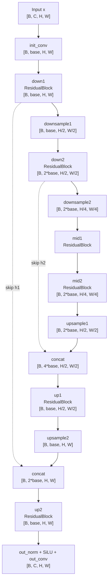

# UNet

This document summarizes the minimal UNet implementation in `dotdiffusion/unet.py`.

The `UNet` class implements a small denoising neural network for DDPM-style noise prediction.

Given a noisy image $x_t$ and a timestep $t$, the model predicts the noise component:

$$
\epsilon_\theta(x_t, t) \approx \epsilon.
$$

In code:

```python
pred_noise = model(x_t, t)
```

The output has the same shape as the input image:

```text
[B, C, H, W]
```

This model is intended to be used together with `GaussianDiffusion.training_loss`, where the predicted noise is compared against the actual Gaussian noise added during the forward diffusion process.

## Overview

The implementation is a small UNet with:

- sinusoidal timestep embedding
- residual blocks with timestep conditioning
- two downsampling stages
- two bottleneck residual blocks
- two upsampling stages
- skip connections from the down path to the up path
- optional conditioning through a `cond` vector

The model interface is:

```python
model(x, t, cond=None)
```

where:

- `x` has shape `[B, C, H, W]`
- `t` has shape `[B]`
- `cond`, if provided, has shape `[B, cond_dim]`

The returned tensor has the same shape as `x`.

## Timestep embedding

Diffusion models need to know which timestep they are denoising.

The class `SinusoidalTimeEmbedding` maps integer timesteps to continuous vectors:

```python
SinusoidalTimeEmbedding(time_emb_dim)
```

Input:

```text
[B]
```

Output:

```text
[B, time_emb_dim]
```

The embedding uses sinusoidal features with different frequencies:

$$
\sin(t \omega_i), \ \cos(t \omega_i).
$$

These embeddings are then passed through a small MLP:

```python
self.time_mlp = nn.Sequential(
    SinusoidalTimeEmbedding(time_emb_dim),
    nn.Linear(time_emb_dim, time_emb_dim),
    nn.SiLU(),
    nn.Linear(time_emb_dim, time_emb_dim),
)
```

The resulting vector `time_emb` is used inside every residual block.

## Residual block

The class `ResidualBlock` is a small ResNet-style block with timestep conditioning.

It applies:

1. GroupNorm
2. SiLU activation
3. 3x3 convolution
4. timestep embedding projection
5. GroupNorm
6. SiLU activation
7. 3x3 convolution
8. residual connection

In simplified form:

```python
h = conv1(silu(norm1(x)))
h = h + time_proj(time_emb)[:, :, None, None]
h = conv2(silu(norm2(h)))
out = h + shortcut(x)
```

The timestep embedding is projected to the output channel dimension and added to the feature map after the first convolution.

If the input and output channels are different, the shortcut path uses a 1x1 convolution:

```python
self.shortcut = nn.Conv2d(in_channels, out_channels, kernel_size=1)
```

Otherwise, it uses an identity mapping.

## GroupNorm helper

The helper function `_num_groups` chooses a valid number of groups for `nn.GroupNorm`.

```python
def _num_groups(channels: int) -> int:
    for g in [32, 16, 8, 4, 2, 1]:
        if channels % g == 0:
            return g
    return 1
```

This avoids invalid GroupNorm settings when the number of channels is not divisible by 32.

## Downsampling and upsampling

The class `Downsample` halves the spatial resolution using a strided convolution:

```python
nn.Conv2d(channels, channels, kernel_size=4, stride=2, padding=1)
```

If the input shape is:

```text
[B, C, H, W]
```

then the output shape is approximately:

```text
[B, C, H/2, W/2]
```

The class `Upsample` doubles the spatial resolution using nearest-neighbor interpolation followed by a 3x3 convolution:

```python
x = F.interpolate(x, scale_factor=2.0, mode="nearest")
x = self.conv(x)
```

If the input shape is:

```text
[B, C, H, W]
```

then the output shape is approximately:

```text
[B, C, 2H, 2W]
```

This implementation is intended for image sizes divisible by 4, such as 32x32 or 64x64.

## Architecture

The UNet consists of a down path, a bottleneck, and an up path.

The down path reduces spatial resolution while extracting features.
The up path restores spatial resolution using skip connections from the down path.



The skip connections concatenate high-resolution features from the down path with upsampled features in the up path.

## Shape flow

Let `base = base_channels`.

Assume the input has shape:

```text
[B, C, H, W]
```

The shape flow is:

| Step                            | Tensor shape            |
| ------------------------------- | ----------------------- |
| input                           | `[B, C, H, W]`          |
| `init_conv`                     | `[B, base, H, W]`       |
| `down1` / `h1`                  | `[B, base, H, W]`       |
| `downsample1`                   | `[B, base, H/2, W/2]`   |
| `down2` / `h2`                  | `[B, 2*base, H/2, W/2]` |
| `downsample2`                   | `[B, 2*base, H/4, W/4]` |
| `mid1`, `mid2`                  | `[B, 2*base, H/4, W/4]` |
| `upsample1`                     | `[B, 2*base, H/2, W/2]` |
| concat with `h2`                | `[B, 4*base, H/2, W/2]` |
| `up1`                           | `[B, base, H/2, W/2]`   |
| `upsample2`                     | `[B, base, H, W]`       |
| concat with `h1`                | `[B, 2*base, H, W]`     |
| `up2`                           | `[B, base, H, W]`       |
| `out_norm + out_act + out_conv` | `[B, C, H, W]`          |

Thus, the final output has the same shape as the input image.

## Optional conditioning

The model optionally supports an additional conditioning vector `cond`.

If `cond_dim` is provided when creating the model:

```python
model = UNet(cond_dim=512)
```

then the model creates a linear projection:

```python
self.cond_proj = nn.Linear(cond_dim, time_emb_dim)
```

During the forward pass, the projected condition is added to the timestep embedding:

```python
time_emb = time_emb + self.cond_proj(cond)
```

This is a simple conditioning mechanism.

It can be used for early experiments with text embeddings, image embeddings, class labels, or other global conditioning vectors.

However, this is not the same as cross-attention-based conditioning used in larger text-to-image diffusion models.

## Example

```python
import torch
from dotdiffusion import UNet

model = UNet(
    in_channels=3,
    base_channels=64,
    time_emb_dim=256,
)

x = torch.randn(8, 3, 32, 32)
t = torch.randint(0, 1000, (8,))

pred_noise = model(x, t)

print(pred_noise.shape)
# torch.Size([8, 3, 32, 32])
```

With optional conditioning:

```python
import torch
from dotdiffusion import UNet

model = UNet(
    in_channels=3,
    base_channels=64,
    time_emb_dim=256,
    cond_dim=512,
)

x = torch.randn(8, 3, 32, 32)
t = torch.randint(0, 1000, (8,))
cond = torch.randn(8, 512)

pred_noise = model(x, t, cond)

print(pred_noise.shape)
# torch.Size([8, 3, 32, 32])
```

## Notes

This is a minimal UNet intended for learning and experimentation.

Current limitations:

- only two downsampling stages are implemented
- no attention blocks are implemented
- no cross-attention conditioning is implemented
- conditioning is only added to the timestep embedding
- no class embedding module is implemented
- no dropout is implemented
- no configurable channel multipliers are implemented
- input image size should be divisible by 4
- the model is designed for small images such as 32x32 or 64x64

Future extensions may include:

- configurable channel multipliers
- more UNet levels
- self-attention blocks at low resolutions
- cross-attention for text conditioning
- classifier-free guidance support
- class conditioning
- dropout in residual blocks
- LoRA modules for lightweight fine-tuning
- specialized architectures for pixel art generation

## Alias

The file also defines:

```python
SimpleUNet = UNet
```

This is only an alias. It may be useful if the repository later contains multiple UNet variants.

## References

- Hugging Face Blog.  
  *The Annotated Diffusion Model*.  
  https://huggingface.co/blog/annotated-diffusion
